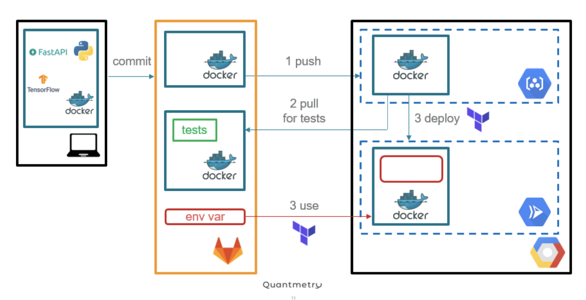

# Deployment an image classification model using FastAPI, Docker and Terraform. 

This project is a toy project aiming to expose a deep learning tensorflow model through an API on the Cloud. 

`
src/app
`
 
contains the source code of the api (main.py) and the model (model.py)
 
 
 

`
src/test
`
  
 
 contains unit and integration tests

 
 

